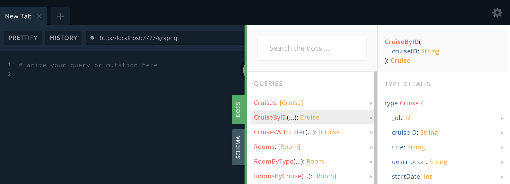
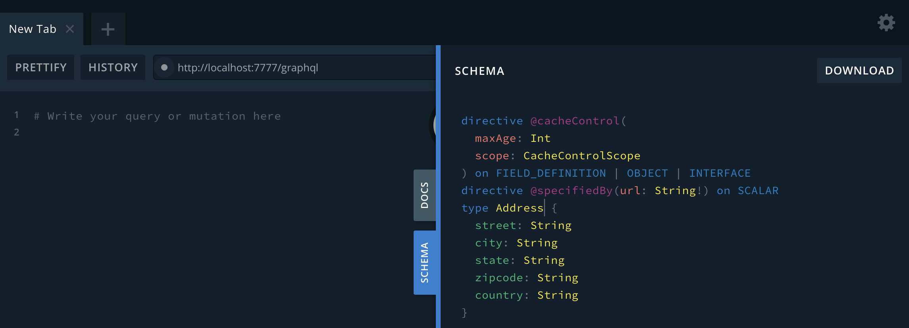
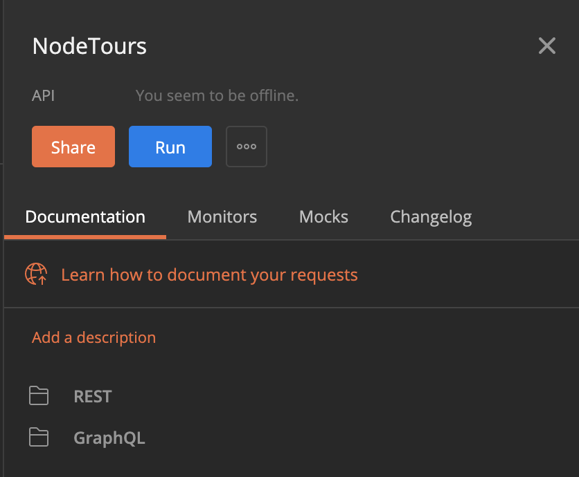
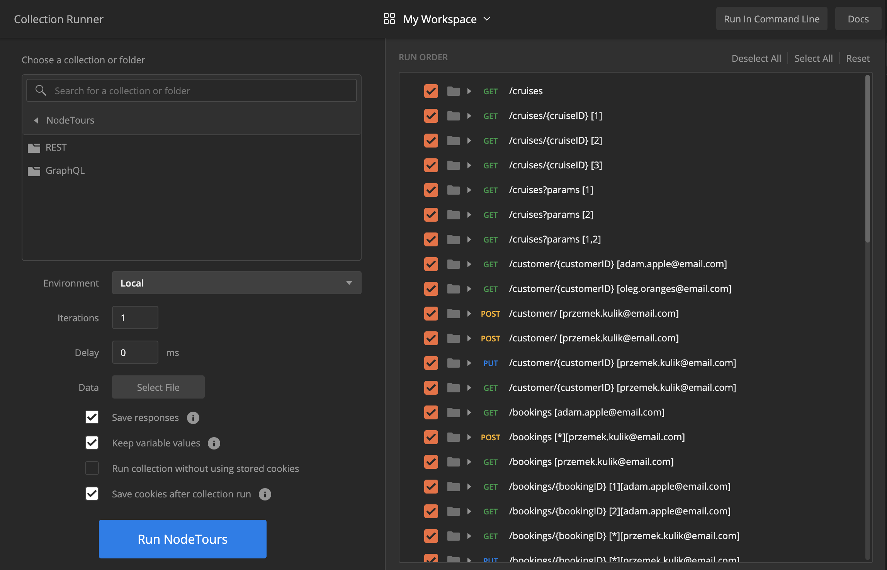
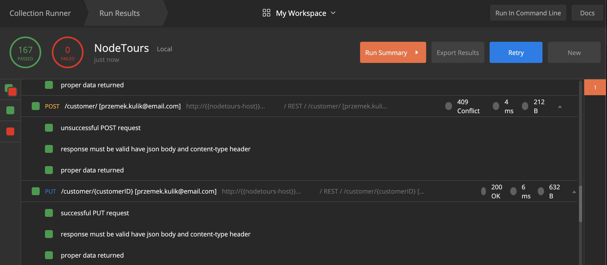

# Using NodeTours

NodeTours app 3.0 implements REST and GraphQL APIs.

## REST

REST API descriptors are located [here](../api/).

## GraphQL

To learn how to use Nodetours GraphQL endpoint, use GraphiQL playground at http://[your-NodeTours-url]/graphql and browse docs

and schema

To get this data programatically use [GraphQL introspection](https://graphql.org/learn/introspection/) API.

Getting started

All NodeTours REST and GraphQL endpoints are documeted in [this](../test/int/NodeTours.postman_collection.json) Postman collection. Use is to learn how to call each API.

You can also use this collection to test your deployment. Simply run the collection

 {width: 25%}

adjust settings

and check the results afterwards

If the deployment went OK, all tests should have passed.
